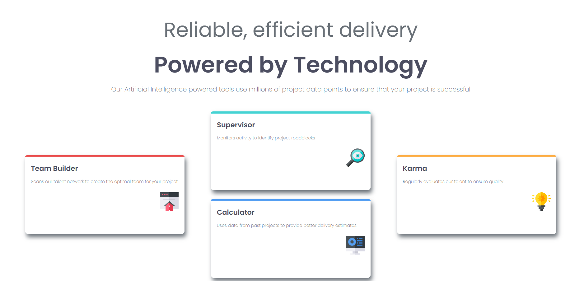
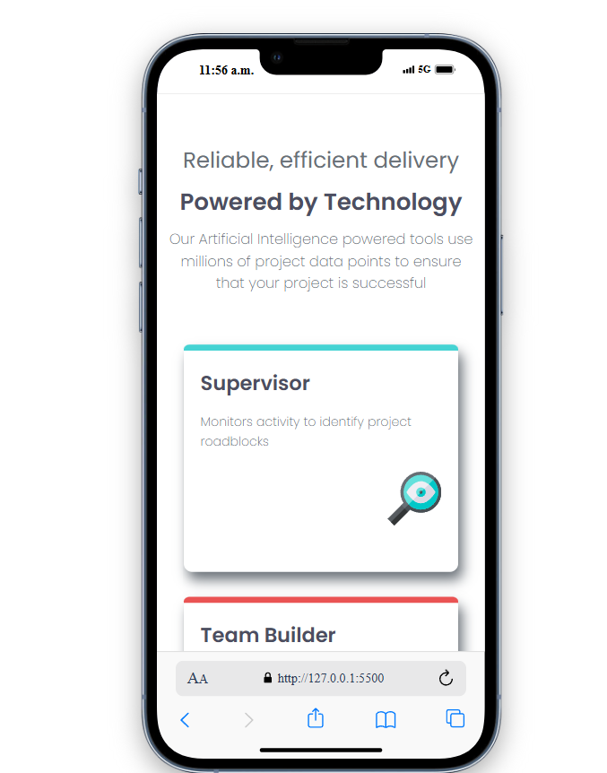

# Four card feature section solution

Es un proyecto para poner en practica CSS GRID

## Table of contents

- [Overview](#overview)
  - [The challenge](#the-challenge)
  - [Screenshot](#screenshot)
  - [Links](#links)
- [Built with](#built-with)
- [Author](#author)

## Overview

### The challenge

Users should be able to:

- View the optimal layout for the site depending on their device's screen size

### Screenshot

### Links

- Live Site URL: [SITE](https://your-live-site-url.com)

## Built with

- Semantic HTML5 markup
- CSS custom properties
- CSS Grid

## Author

- Website - [Melvin Sanchez Vazque](https://www.your-site.com)
